# Hajj Pilgrimage: COVID-19 Impact Analysis
# تحليل أثر كوفيد-19 على موسم الحج

> A personal data analytics project by **kayShahbaaz / خ شهباز**

---

## Why I built this / لماذا بنيت هذا

I've always known Hajj as one of those constants — every year, millions of people make the journey to Makkah. It felt like something that just *happens*, no matter what.

Then 2020 came. And only 1,000 people were allowed.

That number stuck with me. I kept thinking about what that actually means — not just spiritually, but in terms of data. What does a 99.96% drop look like on a chart? How do you even measure the recovery from something like that? And how long does it take for something this massive to go back to normal?

I'm not a professional analyst. I'm someone who got curious and decided to actually look at the numbers. This project is me trying to answer those questions properly — with real data, real SQL, and a dashboard I built myself.

The data covers 2017 to 2023. I started in early 2024, so 2023 is the most recent complete season I had access to.

---

## What this project covers / ما يغطيه هذا المشروع

- 7 years of official Hajj attendance data (2017–2023)
- COVID-19 policy timeline — what changed each year and why
- Makkah vs Madinah visitor split
- Top 10 countries by pilgrim count
- Economic impact on Saudi Arabia
- Deaths and safety incidents per year
- A 2024 recovery forecast based on the trend

---

## Tools used / الأدوات المستخدمة

| Tool | Purpose |
|------|---------|
| Microsoft Excel | Data cleaning, pivot tables, initial exploration |
| SQLite | Querying, aggregations, year-on-year analysis |
| HTML / CSS / JavaScript | Dashboard front-end |
| Chart.js (v4.4.1) | Data visualisation |
| VS Code | Writing everything |
| GitHub Pages | Hosting the dashboard |

---

## Data sources / مصادر البيانات

- **GASTAT** — General Authority for Statistics, Saudi Arabia (gastat.gov.sa)
- **Saudi Ministry of Hajj and Umrah** — official pilgrim counts
- **CDC Yellow Book 2024** — vaccination and health requirements
- **Arab News** — economic impact reporting
- **Al Jazeera** — country breakdown figures (2017)
- **PBS NewsHour / AFP** — safety and deaths data

All numbers are cross-referenced across at least two sources where possible.

---

## Preview / معاينة

**Overview tab — header, KPI cards, and attendance chart**
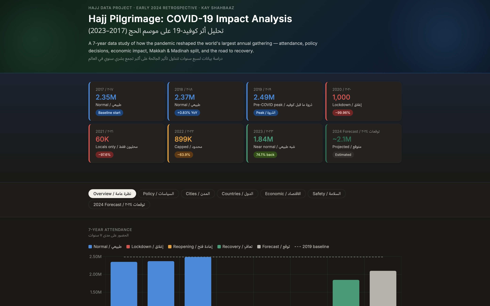

**Overview tab — recovery trajectory and year-on-year change**
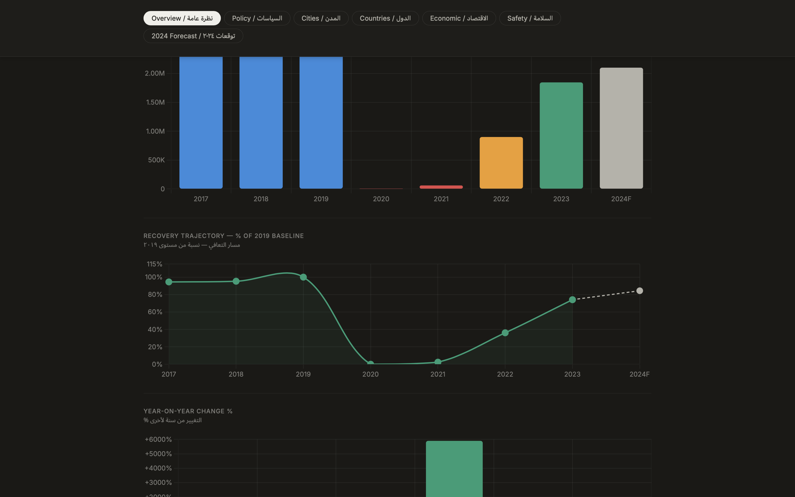

**Overview tab — key insights**
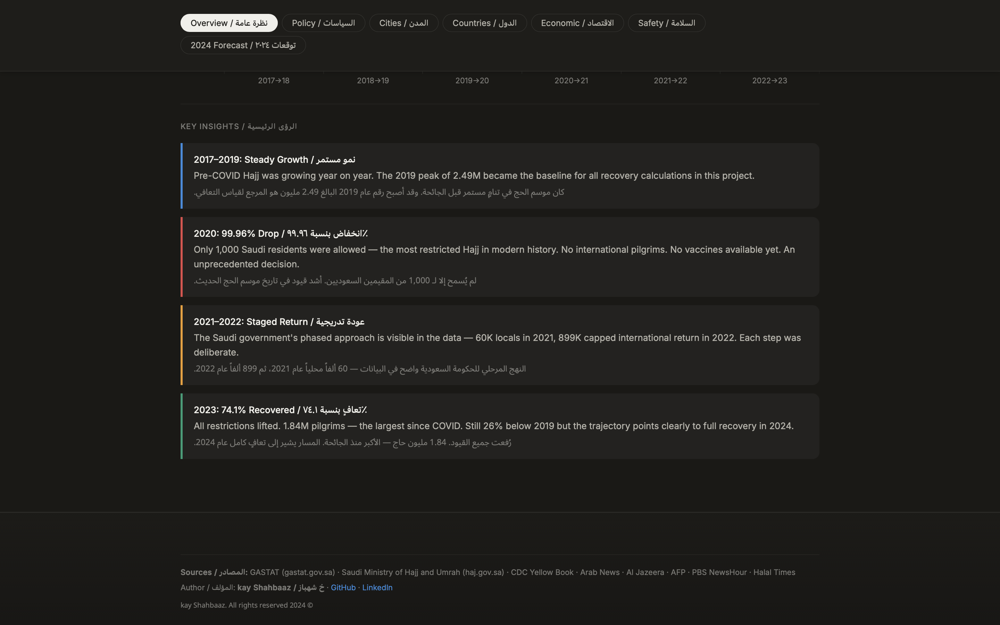

**Policy timeline — expandable year-by-year COVID restrictions**
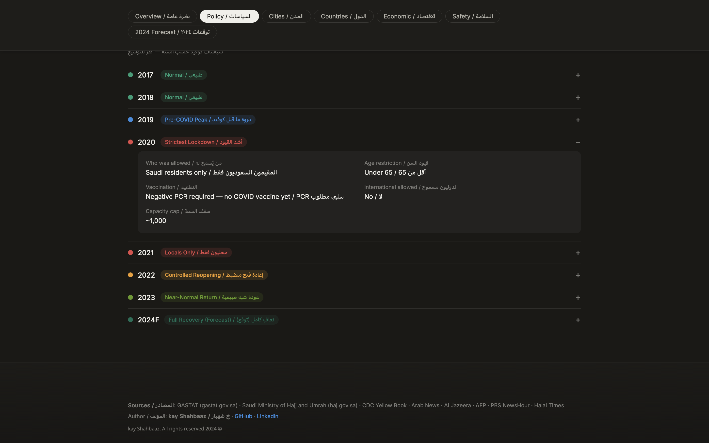

**Cities tab — Makkah vs Madinah, internal vs international split**
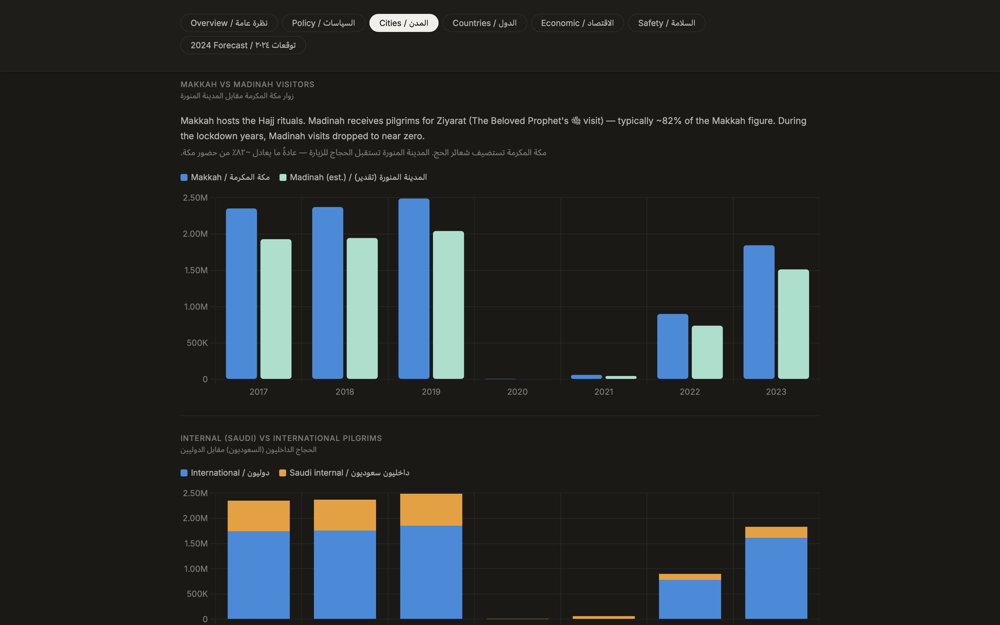

**Countries tab — top pilgrim-sending countries by year**
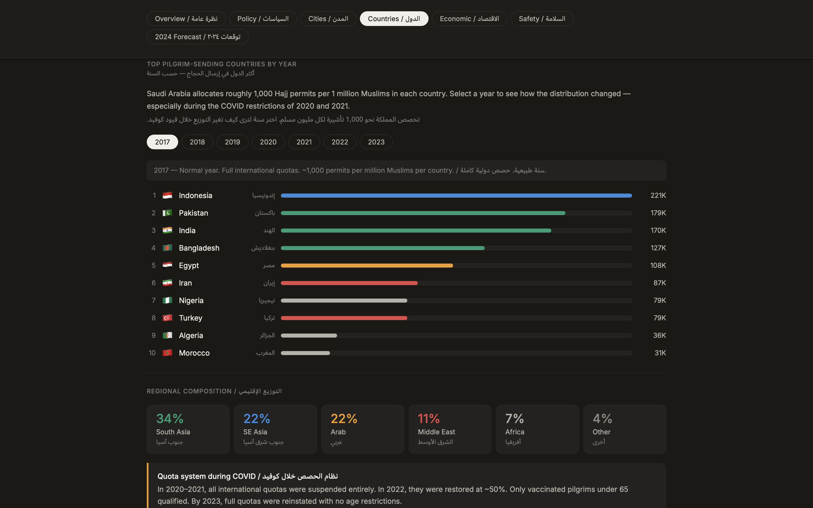

**Economic tab — revenue and jobs supported by Hajj season**
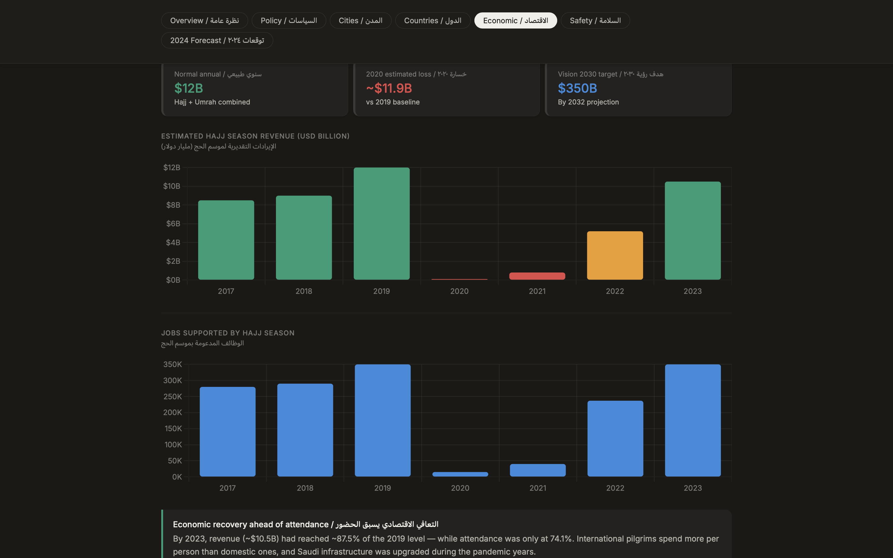

**Safety tab — reported deaths and mortality rate per year**
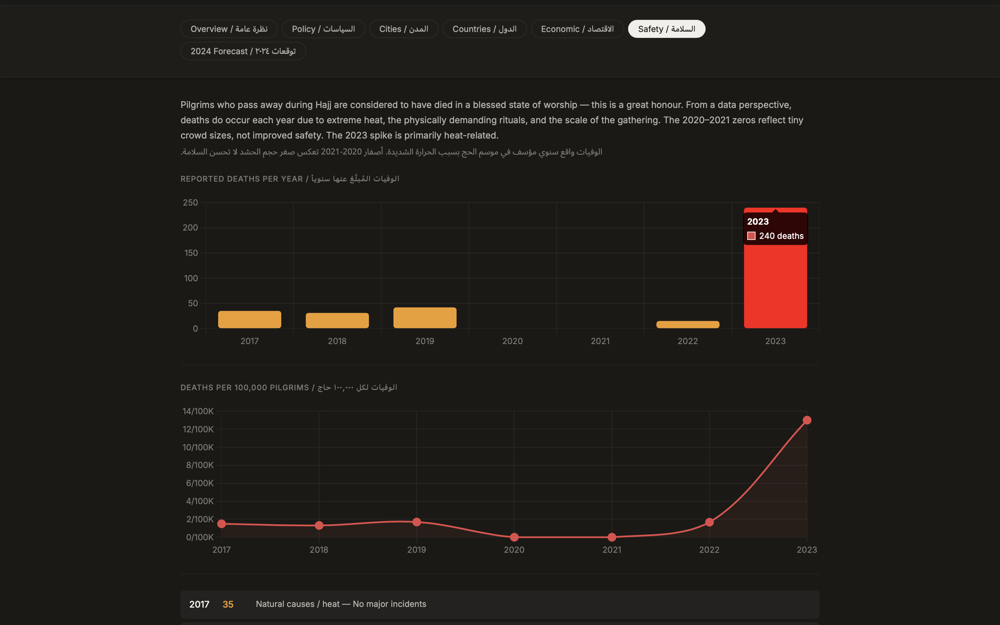

**Safety tab — year-by-year breakdown and heat risk note**
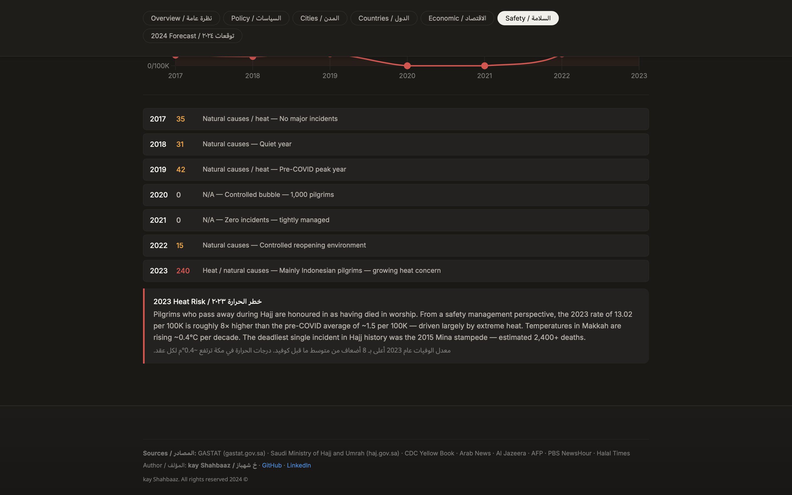

**2024 Forecast — recovery arc with forecast band**
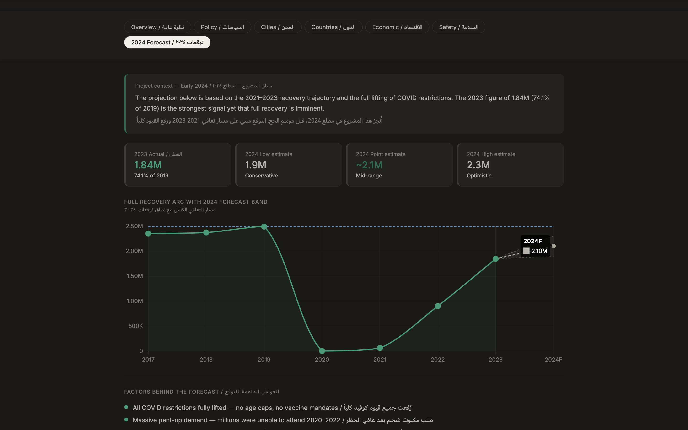

**2024 Forecast — supporting factors**
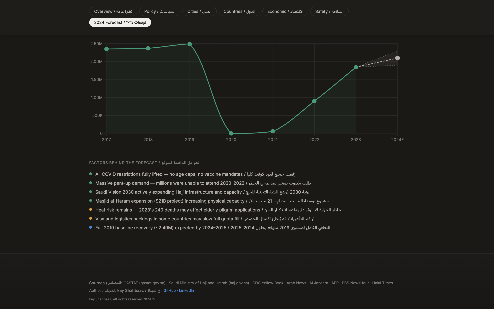

---

## Project structure / هيكل المشروع

```
hajj-covid-impact-analysis/
├── README.md                   ← you are here
├── index.html                  ← live dashboard
├── assets/
│   └── style.css               ← dashboard styles
├── data/
│   ├── attendance.csv          ← raw attendance data
│   ├── policy.csv              ← COVID policy by year
│   ├── countries.csv           ← top 10 pilgrim countries
│   ├── economic.csv            ← revenue and jobs data
│   └── deaths.csv              ← safety incidents
├── analysis/
│   ├── hajj_analysis.sql       ← all SQL queries
│   └── excel_notes.md          ← Excel cleaning steps
└── report/
    └── final_report.md         ← full written analysis
```

---

## How to run it / كيفية تشغيله

1. Clone the repo:
```bash
git clone https://github.com/YOUR_USERNAME/hajj-covid-impact-analysis.git
cd hajj-covid-impact-analysis
```

2. Open `index.html` in your browser. That's it — no build step, no dependencies to install.

Or visit the live version on GitHub Pages: `https://YOUR_USERNAME.github.io/hajj-covid-impact-analysis`

For the SQL analysis:
```bash
sqlite3 hajj.db < analysis/hajj_analysis.sql
```

---

## Key findings / النتائج الرئيسية

- 2020 saw a **99.96% drop** in attendance — from 2.49M to just 1,000 pilgrims
- The Saudi government's phased approach (2020 → 2021 → 2022 → 2023) is visible clearly in the data as a deliberate, staged recovery
- By 2023, attendance reached **1.84M** — about 73.9% of the 2019 peak
- The economic loss in 2020 is estimated at around **$11.9 billion** compared to 2019
- 2023 deaths (240, mostly heat-related) signal a growing climate concern that doesn't show up in attendance numbers

---

## What I'd do next / ما سأفعله لاحقاً

- Add Umrah data alongside Hajj for a more complete picture
- Include temperature data to properly analyse the heat-deaths relationship

---

## Author / المؤلف

**kayShahbaaz / خ شهباز**  

---

*This project was built for learning purposes. All data is publicly available from official sources cited above.*


